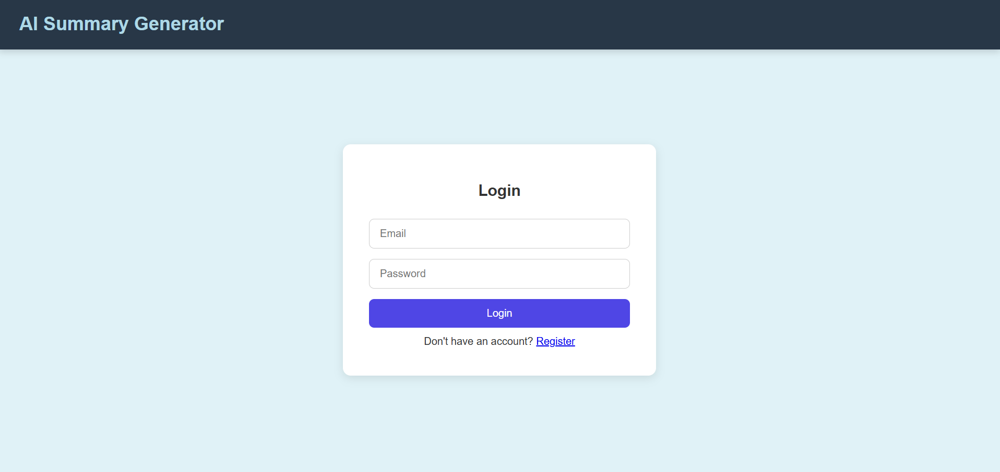

# 🎥 Video Insight Summarizer

A full-stack MERN application that fetches YouTube video transcripts and (in future) provides AI-powered summaries. Users can register, log in, and interact with a clean dashboard. Admins can manage user data. The application includes authentication, protected routes, and a role-based access system.

> ⚠️ Note: Due to time constraints, the **history tracking** and **payment integration** features are not implemented yet. The summarization currently returns fixed content due to API quota issues.

---

## 🛠️ Prerequisites

Make sure the following are installed on your machine:

- **Node.js** (v16+)
- **MongoDB Atlas** (with an active cluster)
- **Firebase Project** (for client-side authentication)
- **.env** file configured properly (see `.env.example`)
- (Optional) **Postman** to test API endpoints

---

## 🚀 How to Run This Project

### 1. Clone the Repository

- git clone https://github.com/your-username/video-insight-summarizer.git
- cd video-insight-summarizer

### 2. Install Dependencies

#### Backend

- cd video-insight-backend
- npm install

#### Frontend

- cd ../video-insight-frontend
- npm install

### 3. Set Up Environment Variables in backend folder

- MONGO_URI=your_mongo_uri_here
- JWT_SECRET=your_secret-key
- YOUTUBE_API_KEY=youtube-secret_api_key
- OPENAI_API_KEY=openai_api_key

### 4. Start the App

#### Start Backend Server

- cd video-insight-backend
- node index.js

#### Start Frontend Dev Server

- cd ../video-insight-frontend
- npm start

---

## Features Implemented

✅ Firebase Authentication (Email & Password)

✅ Protected Routes

✅ Role-based Access (User/Admin)

Admin credentials-

Username - ritesh@gmail.com

Pass - Ritesh@123

✅ YouTube Video Transcript Extraction

✅ Admin Dashboard (User List View)

✅ Loading Indicators and Error Handling

✅ Basic Summary Placeholder (Static text)

## 🚧 Features Not Yet Implemented

❌ Payment Gateway Integration (e.g., Razorpay)

❌ Daily Free Quota System

❌ Summary History (for users)

## 📸 Screenshots

🔐 Login Page

📝 Register Page

📊 User Dashboard

🛠 Admin Panel

## 📦 Tech Stack

**Frontend**: React.js, Axios, Js, HTML,CSS

**Backend**: Node.js, Express.js, MongoDB, Mongoose

**AI Integration**: OpenAI

**Deployment**: Netlify (frontend), Render (backend)

## 💡 Contributing

Pull requests are welcome. For major changes, please open an issue first.

## 📄 License

This project is for educational and demonstration purposes only.
